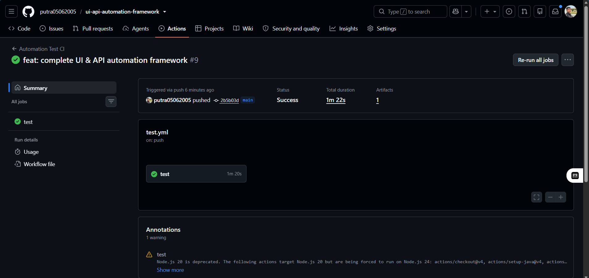
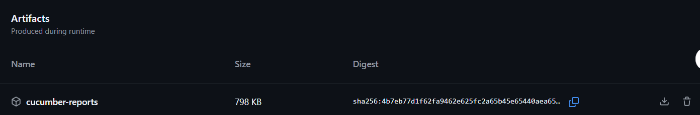
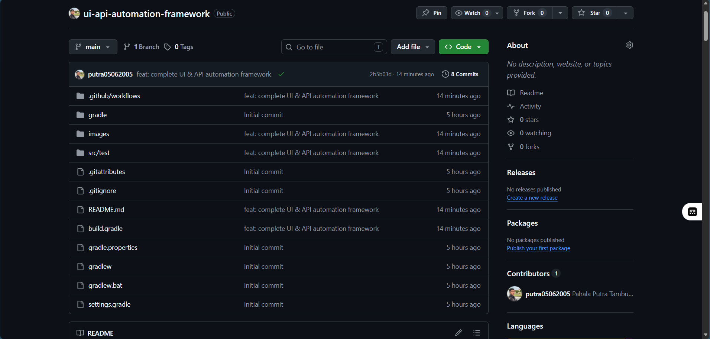
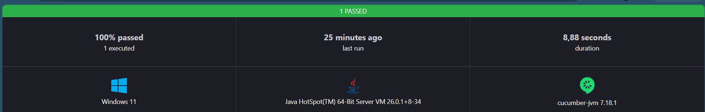
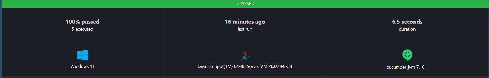

# 🚀 UI & API Automation Framework

<div align="center">

### Complete UI & API Automation Testing Framework

<p>


</p>

### 🧪 Web UI Automation + REST API Automation

Built with **Java • Selenium WebDriver • Rest Assured • Cucumber • Gradle • GitHub Actions**

> **Write once. Test everywhere. Automate everything.**

</div>

---

# 📖 Overview

This project is a complete **UI & API Automation Testing Framework** developed using **Java**, **Selenium WebDriver**, **Rest Assured**, **Cucumber (BDD)**, **Gradle**, and **GitHub Actions**.

The framework combines **Web UI Automation** and **REST API Automation** in a single repository while implementing industry best practices such as:

* Page Object Model (POM)
* Behavior Driven Development (BDD)
* Reusable Step Definitions
* Automated HTML & JSON Reports
* Continuous Integration (CI)

---

# 📚 Table of Contents

* Overview
* Tech Stack
* Key Features
* Project Structure
* Automation Workflow
* Web UI Automation
* API Automation
* Execute Test
* Generated Reports
* GitHub Actions
* Project Preview
* Automation Summary
* Future Improvements
* About the Author
* License

---

# 🛠 Tech Stack

| Category          | Technology         |
| ----------------- | ------------------ |
| Language          | Java 17            |
| UI Testing        | Selenium WebDriver |
| API Testing       | Rest Assured       |
| BDD               | Cucumber           |
| Testing Framework | JUnit 5            |
| Build Tool        | Gradle             |
| CI/CD             | GitHub Actions     |
| Design Pattern    | Page Object Model  |

---

# 🎯 Key Features

* Unified Web UI & API Automation Framework
* Page Object Model (POM)
* Behavior Driven Development (BDD)
* Separate Web & API Test Structure
* Reusable Test Components
* HTML & JSON Reporting
* GitHub Actions Continuous Integration
* Easy Test Execution using Gradle

---

# ✅ Project Achievement

* ✅ Web UI Automation
* ✅ REST API Automation
* ✅ Selenium WebDriver
* ✅ Rest Assured
* ✅ Cucumber BDD
* ✅ Page Object Model
* ✅ HTML Report
* ✅ JSON Report
* ✅ GitHub Actions CI
* ✅ Pull Request Workflow
* ✅ Manual Trigger Workflow
* ✅ Report Artifact Upload

---

# 📂 Project Structure

```text
automation-framework
│
├── .github
│   └── workflows
│       └── test.yml
│
├── images
│
├── src
│   └── test
│       ├── java
│       │   ├── api
│       │   ├── common
│       │   └── web
│       │       ├── pages
│       │       ├── runners
│       │       └── steps
│       │
│       └── resources
│           └── features
│               ├── api
│               └── web
│
├── build.gradle
└── README.md
```

---

# 🔄 Automation Workflow

```text
Feature File
      │
      ▼
Step Definition
      │
      ▼
Page Object / API Request
      │
      ▼
Assertion
      │
      ▼
Cucumber Report
      │
      ▼
GitHub Actions CI
```

---

# 🌐 Web UI Automation

**Target Website**

https://www.saucedemo.com/

### Automated End-to-End Scenario

* Login
* Add Product to Cart
* Open Shopping Cart
* Checkout Product
* Fill Customer Information
* Complete Checkout
* Verify Successful Order

### Design Pattern

This project follows the **Page Object Model (POM)** design pattern.

Implemented Pages:

* LoginPage
* ProductPage
* CartPage
* CheckoutPage

---

# 🔗 API Automation

**Target API**

https://jsonplaceholder.typicode.com/

> JSONPlaceholder is used to demonstrate REST API automation for CRUD operations.

### Automated Scenarios

| Method | Endpoint    | Validation      |
| ------ | ----------- | --------------- |
| GET    | /users      | Get User List   |
| GET    | /users/{id} | Get User Detail |
| POST   | /users      | Create User     |
| PUT    | /users/{id} | Update User     |
| DELETE | /users/{id} | Delete User     |

### Response Validation

* HTTP Status Code
* Response Body
* User ID
* User Name
* User Email

---

# ▶️ Execute Test

### Run Web Automation

```bash
./gradlew runWeb
```

### Run API Automation

```bash
./gradlew runApi
```

### Build Project

```bash
./gradlew clean build
```

---

# 📊 Generated Reports

Cucumber automatically generates reports after each execution.

```text
build/
└── reports/
    └── cucumber/
        ├── api-report.html
        ├── api-report.json
        ├── web-report.html
        └── web-report.json
```

Reports are also uploaded automatically as GitHub Actions Artifacts.

---

# ⚙️ GitHub Actions

The CI pipeline is implemented using **GitHub Actions**.

Workflow triggers:

* Push
* Pull Request
* Manual Trigger

Pipeline steps:

* Checkout Repository
* Setup Java
* Build Project
* Execute Web Automation
* Execute API Automation
* Generate Reports
* Upload Report Artifact

---

# 📸 Project Preview

## 🚀 GitHub Actions Workflow



---

## 📦 Workflow Artifact



---

## 📁 Repository Overview



---

## 🌐 Web Automation Report



---

## 🔗 API Automation Report



---

# 📈 Automation Summary

| Category       | Total |
| -------------- | ----: |
| Web Scenario   |     1 |
| API Scenario   |     5 |
| Total Scenario |     6 |
| Total Steps    |    17 |
| HTML Report    |     ✅ |
| JSON Report    |     ✅ |
| GitHub Actions |     ✅ |

---

# 🚀 Future Improvements

* Docker Integration
* Jenkins Pipeline
* Allure Report
* Parallel Execution
* Cross Browser Testing
* Data Driven Testing
* Environment Configuration
* Retry Mechanism

---

# 👨‍💻 About the Author

## Pahala Putra Tambunan

**Diploma in Computer Technology**

Institut Teknologi Del

Interested in:

* QA Automation
* Software Testing
* Site Reliability Engineering (SRE)
* DevOps
* Backend Development

---

## 🌐 Connect with Me

**GitHub**

https://github.com/putra05062005

**LinkedIn**

https://www.linkedin.com/in/pahala-putra-t-403915335/

**Portfolio**

https://flyingbird05062005.wixsite.com/myportofolio

**Email**

[rftkohin@gmail.com](mailto:rftkohin@gmail.com)

---

# 📄 License

This project is created for educational and portfolio purposes.

---

<div align="center">

## ⭐ Thank You for Visiting!

If you find this project useful, consider giving it a ⭐.

Made with ❤️ by **Pahala Putra Tambunan**

</div>
